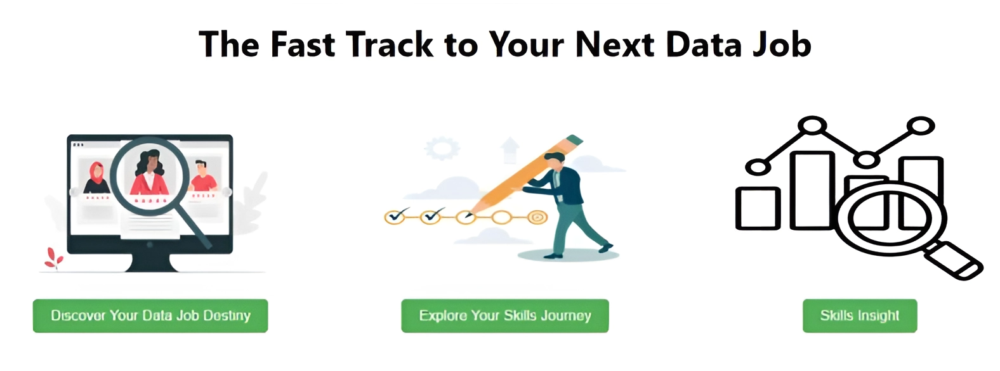
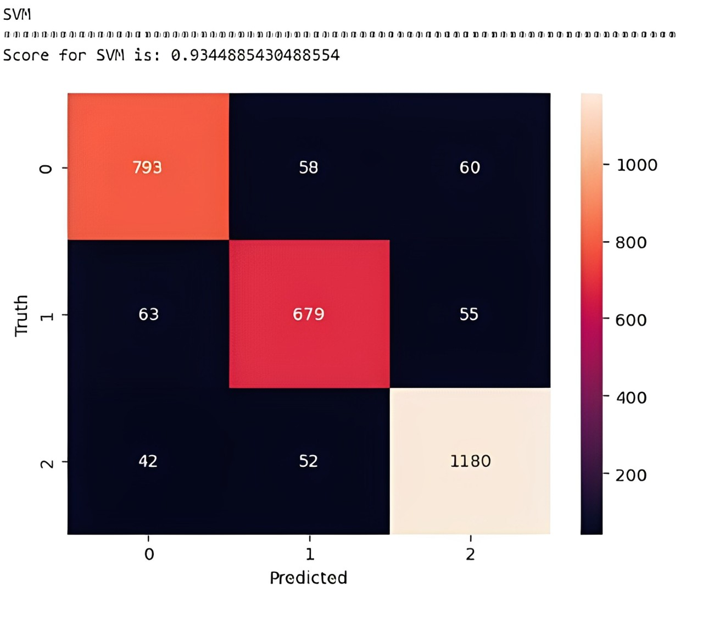
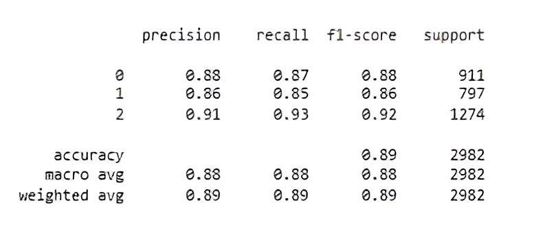
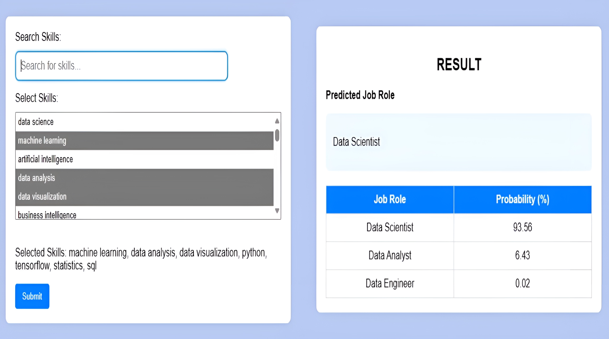
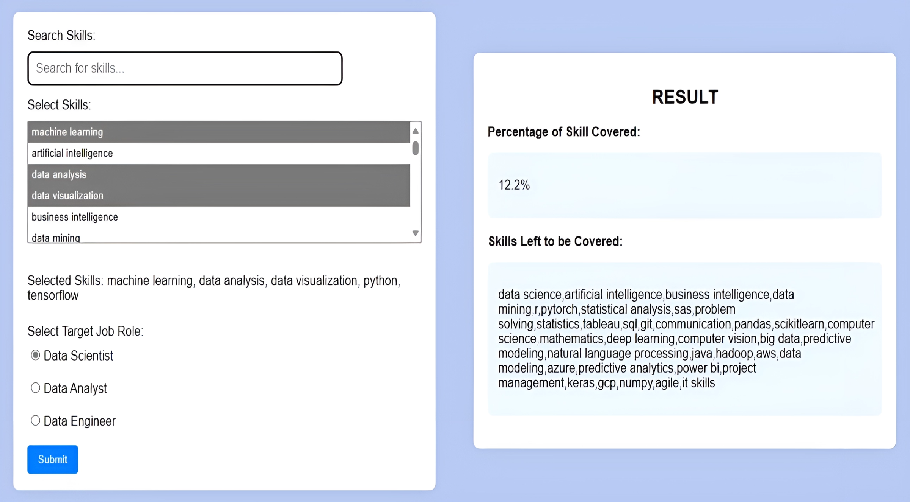
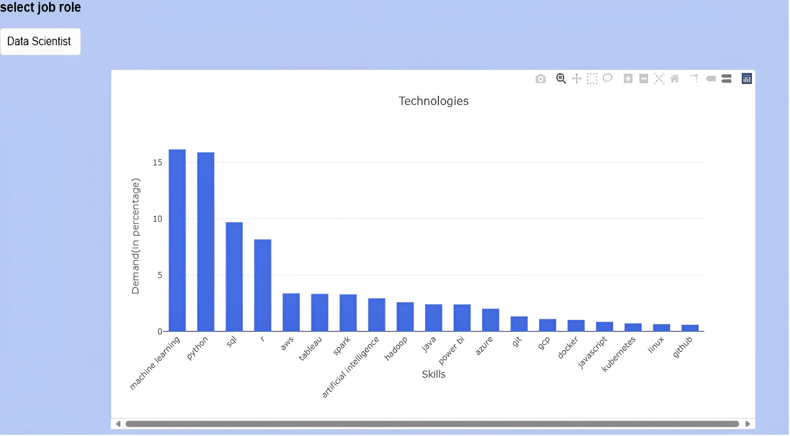
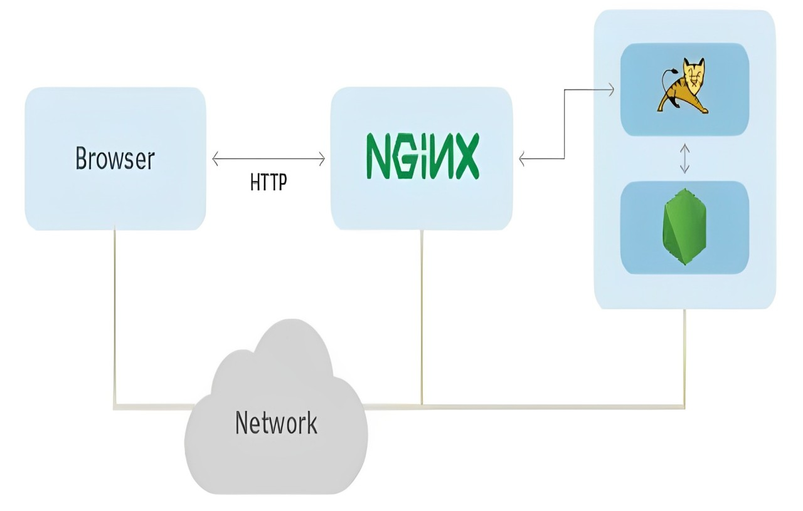

# Data Job Classification and Analysis




## Overview
<a name="overview"></a>
The realm of data is expansive, encompassing a myriad of skills essential for entry. Roles such as Data Scientists, Data Analysts, and Data Engineers all share the common term 'Data' in their titles, implying a connection to data-related tasks. However, discerning between these roles becomes challenging when attempting to delineate their skill requirements, as there is significant overlap among the skills, making it difficult to identify the key competencies within the vast landscape of data-related expertise.

Data Job Classification/Analysis has been designed to address precisely this issue. It assists in predicting the ideal data-oriented role tailored to your skills, offers insights into the specific skills required for a given data role, and provides an analysis of the skills currently in demand.


## Table of Contents
1. [Introduction](#overview)
2. [Getting Started](#getting-started)
3. [Usage](#usage)
   - [Data Preparation](#data-preparation)
   - [Model Training](#model-training)
4. [Project Structure](#project-structure)
5. [Results](#results)
6. [Deployment](#deployment)
7. [Contribution](#contribution)


## Getting Started
<a name="getting-started"></a>
The project includes a Flask server implemented in `server.py`. It can be run using code editors such as VSCode or PyCharm. The server will be hosted locally, and the web application can be accessed by opening the browser and navigating to http://localhost:5000. To launch the web application, follow these steps:

```bash
# Clone the repository
git clone https://github.com/yc1909/Data_Job_Classification_and_Analysis.git

# Navigate to the project directory
cd Data_Job_Classification

# Install the required dependencies
pip install -r requirements.txt
```

## Usage
<a name="usage"></a>
1. The project is capable of predicting the user's data role by analyzing the skills they input.
2. Additionally, the model offers insights into skill alignment with specific data roles. It presents a percentage of covered skills and a list of skills that still need attention.
3. Finally, the tool visually represents the sought-after skills (technologies, packages, and soft skills) for each data role, providing users with a clear understanding of the current demand trends.

### Data Preparation
<a name="data-preparation"></a>
The dataset, `ds_jobs.csv` was created through the integration of three distinct job listing datasets obtained from sources such as https://www.kaggle.com/datasets, https://data.world/datasets/open-data, and https://www.statista.com/. Following this, a meticulous process of cleaning and engineering was undertaken to refine the dataset and enhance its quality.  

### Model Training
<a name="model-training"></a>
Different machine learning models were trained and hyperparameter tuned using GridSearchCV, and among them, the Support Vector Classifier (SVC) demonstrated superior performance, achieving an overall score of 93%. The trained model is present in `data_science_classifier_final.pickle`. Below are the results of model training:






## Project Structure
<a name="project-structure"></a>

```bash

- Data_Job_Classification_Analysis                            
  - README.md                                          --- This is the readme file of the project, containing description of the project.
  - application                                        --- Contains all the important files needed to build the project.                                     
    - artifacts                                        --- Stored artifacts like trained models and skills lists.
      - complete_skills_list.json                      --- Contains a list of all the keys skills required per data job.
      - count_vector.pickle                            --- Contains trained count vectorizer that converts text into numbers.
      - data_position_classify_dict.json               --- Contains a python dictionary with keys as job role text and value as job role num.
      - data_science_classifier_final.pickle           --- Contains the final trained SVM model
      - in_demand_skills_0.json                        --- List of core skills of a Data Scientist.
      - in_demand_skills_1.json                        --- List of core skills of a Data Analyst.
      - in_demand_skills_2.json                        --- List of core skills of a Data Engineer.
      - tfidf_transformer.pickle                       --- Transforms a count matrix to a normalized tf or tf-idf representation.
    - server.py                                        --- Flask server implementation
    - static                                           --- Contains all JS and CSS files
      - feature1.css                                   --- CSS of feature1 i.e. Discover Your Data Job Destiny.
      - feature2.css                                   --- CSS of feature2 i.e. Explore Your Skills Journey.                                 
      - feature3.css                                   --- CSS of feature3 i.e. Skills Insight.
      - images                                         --- Landing Page images folder.
        - 3315370-200.png
        - job-hunt-concept-illustration_114360-446.jpg
        - progress.jpg
      - index.css                                      --- Landing page CSS.
      - script.js                                      --- JS implementation of feature1.
      - script2.js                                     --- JS implementation of feature2.
      - script3.js                                     --- JS implementation of feature3.
      - separated_in_demand_skills_0.json              --- Dictionary containing skills divided into technologies,packages and soft skills per job role.
    - templates                                        --- HTML templates
      - feature1.html
      - feature2.html
      - feature3.html
      - index.html
    - util.py                                          --- All utility functions are present here.
  - assets                                             --- Additional assets.
    - confusion_matrix.jpg                             --- Image file (confusion matrix of Support Vector Classifier).
    - classification_report.jpeg                       --- Image file (classification report of Support Vector Machine).
    - feature1_result.jpeg                             --- Image file (working of feature1).
    - feature2_result.jpeg                             --- Image file (working of feature2).
    - feature3_result.jpeg                             --- Image file (working of feature3).
    - landing_page.jpeg                                --- Image file (landing page illustration).
    - nginx_setup_illustration.jpg                     --- Image file (nginx setup illustartion).
  - model                                              --- Model-related files.
    - Data Scientist Classification.ipynb              --- Jupyter notebook of Data Job Classification and Analysis.
    - dataset                                          --- Dataset directory.
      - ds_jobs.csv                                    --- CSV file containing data job information.
  - requirements.txt                                   --- List of project dependencies
```

## Results
<a name="results"></a>
1. The first feature, 'Discover Your Data Job Destiny', involves a role predictor utilizing the trained model `data_science_classifier_final.pickle`. This feature receives a list of user skills, offering job role suggestions along with corresponding probabilities for each category based on the provided skills.



2. The second feature,'Explore Your Skills Journey', is a skill analyzer that, when given the desired job role and user-provided skills, calculates the percentage of total skills covered and provides a list of skills that still need to be acquired. This functionality is accomplished through the implementation of the `missing_skills_analysis()` function in the `util.py` file.



3. The third feature,'Skills Insight,' presents a visual display of sought-after skills for job roles. This is achieved through a Python dictionary `separated_in_demand_skills_0.json`, which contains skills for each role divided into three categories: technologies, packages, and soft skills. The implementation involves the use of JavaScript to create the graphical representation.




## Deployment
<a name="deployment"></a>
The application was deployed on an AWS EC2 instance with aim of making it dynamic. Nginx was employed to handle all incoming HTTP requests. A reverse proxy configuration was implemented to route these requests to the Python Flask Server, which is also hosted on the same EC2 instance.




## Contribution
<a name="contribution"></a>
Suggestions for enhancing the application:

1. Optimize the model by retraining it with the least predictive features.
2. Integrate a fourth feature employing a regression model to forecast salary based on data roles.
3. Preprocess data through the utilization of NLP packages such as spaCy, Gensim, etc., aiming to further improve performance score.

Pull requests are welcome! For significant modifications, kindly initiate an issue for discussion before implementing changes or contributing.
